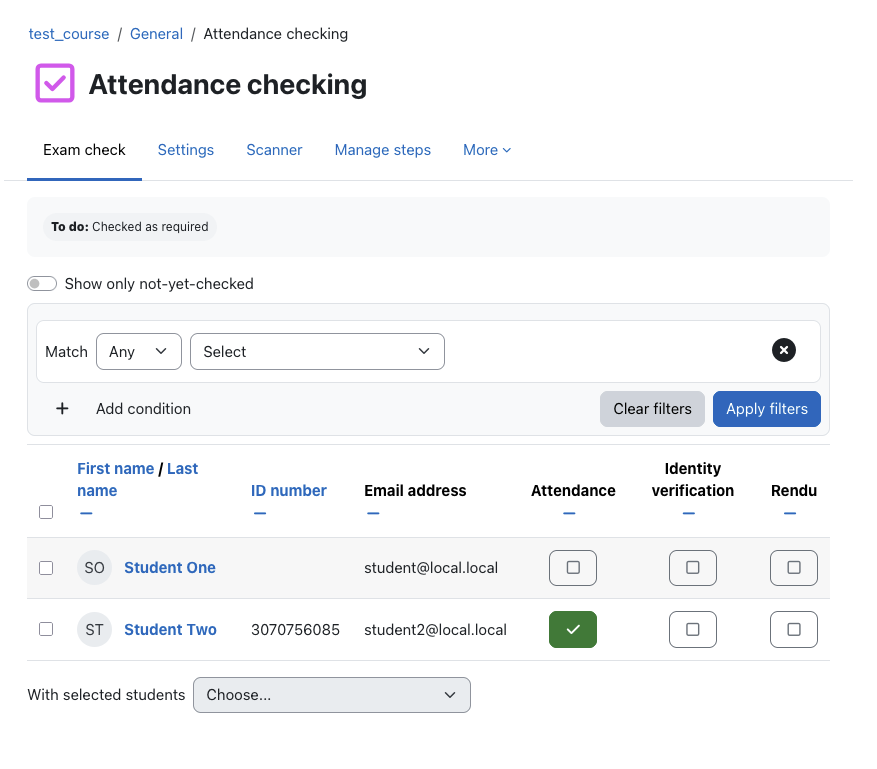
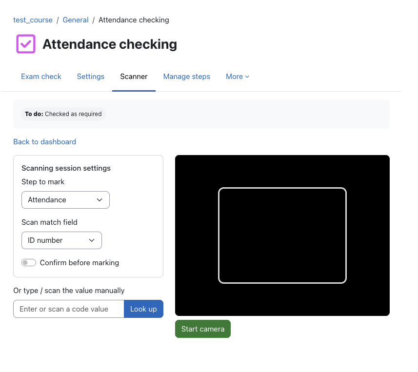
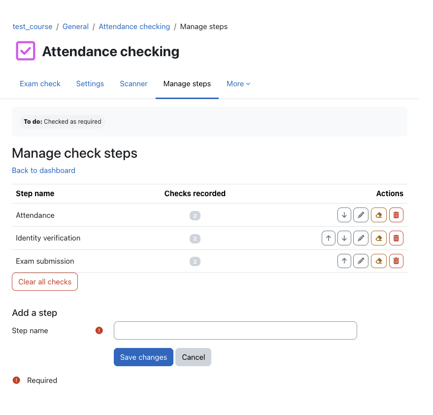

# Exam check (mod_examcheck)

[](https://github.com/a-camacho/moodle-mod_examcheck/actions/workflows/moodle-ci.yml)

A Moodle activity for **running attendance and verification checks on exam day**.
A teacher picks a group, then ticks students off through one or more *check
steps* — attendance, identity verification, exam copy submitted, or any custom
step you define. Several teachers can work the same roster **at the same time**
from their own phones, each student is checked **once per step**, and a camera
page lets you **scan a QR code or barcode** on a student card to mark students
hands‑free.

- **Plugin type:** activity module (`mod_examcheck`)
- **Moodle:** 5.1 or later (tested against 5.1, branch `501`)
- **PHP:** 8.2 – 8.4
- **Licence:** GNU GPL v3 or later

---

## Why this plugin

On exam day, invigilators need to do three things quickly and reliably:

1. **Confirm who is present** as students arrive at the exam‑room door.
2. **Verify identity** against a student card.
3. **Confirm the exam copy was handed in** at the end.

Doing this on paper is slow and impossible to share between several
invigilators in real time. `mod_examcheck` makes each of these a one‑tap check,
keeps a single shared source of truth across every teacher's device, and turns
the result into a completion condition you can use to gate other activities.

## Features

- **Custom, ordered check steps.** Every activity starts with one *Attendance*
  step; add as many more as you like with your own names (*Identity verified*,
  *Copy submitted*, …) and reorder them.
- **Require step-by-step completion.** An activity-wide *Attendance settings*
  toggle that, when enabled, only lets a student be checked on a step once
  they're already checked on the immediately preceding one. Combines with a
  step's own requirement below — both must be satisfied.
- **Shared, conflict‑safe marking.** A student can only be checked **once per
  step**. If a second teacher tries to check someone already checked, they get a
  clear message — *“Already checked: Jane Doe was marked by Mr Smith, 2 minutes
  ago.”* — instead of a silent double entry.
- **Real‑time, multi‑teacher.** The dashboard refreshes live, so two or more
  invigilators on different phones always see an up‑to‑date roster.
- **Group aware / room separation.** Pick a group (or all participants) using
  the activity's group mode; the roster, scanner and export all respect the
  selection. In **separate groups** mode an invigilator without *access all
  groups* sees **only their own group's students** on the dashboard, scanner and
  export — so you can split students by room and assign one invigilator per room
  without them seeing other rooms.
- **QR / barcode scanning.** Use a phone camera to scan a code printed on the
  student card. Choose which field the code matches: **ID number**, **internal
  user id**, or any **custom profile field**.
- **Extraction pattern (regex).** When the code encodes more than the student
  number, set a regular expression to pull out just the part to match. For a
  card scanning as `U=12345678;LIB=987`, the pattern `(\d{8})` extracts
  `12345678` before comparing it to the chosen field. Configurable per activity
  and overridable per scanning session.
- **Scanner mode: Scanning vs Reading.** A session-only toggle on the scanner
  page (with a site-wide admin default; it always resets to that default on
  page load). *Scanning* behaves as below. *Reading* only looks the scanned
  student up — a toast shows their name and their check status on every step
  — without marking anything, handy for a quick roster check mid‑exam.
- **Mark now or confirm first (Scanning mode).** *Mark immediately* (scan →
  checked → next student automatically) or *confirm first* (scan → the
  student's name is shown → the teacher presses **Confirm and mark**, then
  **Scan next**).
- **Manual entry fallback.** A text box accepts typed values and works with USB
  / Bluetooth “keyboard‑wedge” barcode scanners — handy when the camera API
  isn't available.
- **Completion = checked.** Optionally complete the activity for a student once
  they're checked on **all steps** *or* on **one specific step**. Because
  completion is per student, you can require it elsewhere — e.g. *“Attendance
  must be complete before the quiz opens.”*
- **Requirements for checking, per step.** Optionally gate a step behind one
  of two conditions before a student can be marked: a **submitted quiz
  attempt** (fixed rule — no attempt in progress, and at least one finished
  attempt on a chosen course quiz; useful for an *Exam copy submitted* step
  backed by a real Moodle quiz), or **activity completion** (the student must
  have completion recorded on any other chosen activity in the course). The
  dashboard, the scanner and the bulk check action all refuse to tick the
  student off until their own requirement is satisfied, and show a clear red
  message instead.
- **Search & filter.** Filter the roster by name / ID number and show only
  not‑yet‑checked students.
- **Export.** Download the roster with every step's status, who checked each
  student and when, in CSV / Excel / ODS (any installed data format).
- **Reset.** Clear the checks for one step or the whole activity to reuse it,
  and integration with course reset.
- **Backup & restore, privacy (GDPR), events, capabilities** — all included.

## Screenshots

| Roster                                | Scanner                                 | Manage steps                               |
|---------------------------------------|-----------------------------------------|--------------------------------------------|
|  |  |  |

- **Roster** – tick students through every check step from any teacher's phone.
  Live polling keeps every invigilator's screen in sync.
- **Scanner** – read a QR/barcode from the student card with the camera.
  Manual entry works for keyboard‑wedge scanners too.
- **Manage steps** – add, rename and reorder steps; optionally make a step
  require a submitted quiz attempt, or completion of another activity, before
  the student can be checked.

## Installation

1. **Download** the latest release ZIP from this repository (or `git clone` it),
   then install it like any Moodle plugin — **Site administration → Plugins →
   Install plugins** and upload the ZIP, or extract the folder so it lives at
   `mod/examcheck/` inside your Moodle (the `public/mod/examcheck/` path on a
   "public layout" install).

2. Log in as an administrator and visit **Site administration → Notifications**
   to run the upgrade, **or** from the CLI:

   ```bash
   php admin/cli/upgrade.php
   ```

3. (Optional) Review **Site administration → Plugins → Activity modules → Exam
   check** for site defaults (default scan field, default scanner mode,
   confirm‑before‑marking, live refresh interval).

## Usage

### Create the activity

Add an **Exam check** activity to your course. In the form you can set the
default **scan match field** and whether scanning **confirms before marking**.
The activity is created with a single **Attendance** step.

### Manage steps

From the dashboard choose **Manage steps** (needs `mod/examcheck:managesteps`)
to add, rename, reorder or delete steps, and to clear recorded checks.

When editing a step you can optionally set **Requirements for checking** to
one of:

- **Submitted quiz attempt** — pick a course quiz. This restriction isn't
  customisable: the student must have no attempt in progress, and at least
  one finished (submitted) attempt.
- **Activity completion** — pick any other activity in the course. The
  student being checked must have completion recorded on that activity (the
  invigilator's own completion is never relevant — it's always checked
  against the student being marked).

With either on, every mark path — the dashboard toggle, the scanner (camera
and manual entry) and the bulk‑check action — will refuse to mark a student
who doesn't yet satisfy the requirement. The teacher sees a clear red
message; the cell stays untouched.

### Check students (dashboard)

Open the activity to see the roster grid: one row per student, one toggle per
step. Tap a cell to check / uncheck. The column header shows live progress
(*checked / total*). Use the search box and **Show only not‑yet‑checked** to
focus. Pick a group from the group menu if the activity uses groups.

### Scan (camera)

Choose **Open scanner**. The collapsible **Scanning session settings** box
lists the match field first, then the **Scanner mode**:

- **Scanning mode:** also pick the step, code type and whether to confirm
  before marking, then **Start camera** and point it at the student's
  QR/barcode.
  - **Confirm off:** a scan marks the student and the scanner immediately
    looks for the next one.
  - **Confirm on:** the matched student's name is shown; press **Confirm and
    mark**, then **Scan next** to continue.
- **Reading mode:** the step/code type/confirm controls are hidden. A scan
  looks the student up and shows a toast with their name and their check
  status on every step — nothing is marked.

No camera? Type or wedge‑scan the value into the **manual entry** box.

> **Browser & HTTPS note.** Live camera scanning uses the device camera via the
> standard `getUserMedia` API and decodes barcodes / QR codes with the bundled
> [zxing‑wasm](https://github.com/Sec-ant/zxing-wasm) library — a WebAssembly
> build of the upstream `zxing‑cpp` C++ library — so it works the same on every
> modern browser (Chrome / Edge on desktop and Android, Firefox, Safari on iOS
> and macOS). `getUserMedia` requires the page to be served over **HTTPS** (or
> `localhost`). No camera, no permission, or HTTPS unavailable? Use the
> **manual entry** box — it works with USB / Bluetooth keyboard‑wedge scanners
> too.
>
> **Supported code formats.** The scanner recognises QR Code (including Micro
> QR and Rectangular Micro QR), Data Matrix, Aztec, PDF417, MaxiCode, Code 128,
> Code 39, Code 93, Codabar, Interleaved 2 of 5 (ITF, ITF‑14), EAN‑13, EAN‑8,
> UPC‑A, UPC‑E and GS1 DataBar.
>
> **Web‑server MIME note.** The decoder ships as a ~1 MB `.wasm` file at
> `mod/examcheck/wasm/zxing_reader.wasm`, served as a regular static asset.
> Apache and nginx on any reasonably current distribution already serve `.wasm`
> as `application/wasm` and **need no extra configuration**. The scanner falls
> back gracefully even if the MIME type is wrong, so on hardened/minimal server
> configs it still works; if you want the optimal path, add the mapping
> explicitly: `AddType application/wasm .wasm` (Apache) or
> `types { application/wasm wasm; }` (nginx).

### Completion to gate a quiz

Edit the activity → **Activity completion** → set *Completion tracking* to
**Show activity as complete when conditions are met**, tick **Student must be
checked to complete the activity**, and choose **All steps** or a single step.
Then, on your quiz, add a **Restrict access** rule of *Activity completion →
Exam check must be marked complete*. Students who haven't been checked in can't
start the quiz.

## Capabilities

| Capability                  | Default roles                    | Purpose                                 |
|-----------------------------|----------------------------------|-----------------------------------------|
| `mod/examcheck:addinstance` | editingteacher, manager          | Add the activity                        |
| `mod/examcheck:view`        | teacher, editingteacher, manager | Open the dashboard / export             |
| `mod/examcheck:check`       | teacher, editingteacher, manager | Record / remove checks (list + scanner) |
| `mod/examcheck:override`    | editingteacher, manager          | Remove a mark made by another teacher   |
| `mod/examcheck:managesteps` | editingteacher, manager          | Manage steps, clear checks              |

Students are **not** given access — the activity is teacher‑facing. The roster is
every actively enrolled user who cannot themselves check students.

## Privacy

The plugin stores, per recorded check: the checked student, the teacher who
recorded it, the step, the method (manual / list / scan) and the time. The
privacy provider exports and deletes this data for a user both as the checked
student and as the recording teacher. On deletion, records *about* a user are
removed; records where the user was the *checker* are kept but the checker
reference is anonymised, so other students' records stay intact.

## Development

JavaScript is authored as ES6 modules in `amd/src/` and built to `amd/build/`.

```bash
# from the Moodle root (Node 22.x as required by Moodle)
npx grunt amd --root=mod/examcheck     # or public/mod/examcheck in a public layout
```

### Running the tests

The plugin ships PHPUnit tests under `tests/`. From an initialised Moodle
development site (PHP 8.2–8.4):

```bash
php admin/tool/phpunit/cli/init.php
vendor/bin/phpunit --filter mod_examcheck
# or a single suite
vendor/bin/phpunit public/mod/examcheck/tests/checker_test.php
```

Tests cover the roster and conflict logic, steps, scan‑field matching
(including the extraction regex), reading‑mode lookups, the separate‑groups
access guard, completion (all‑steps and single‑step), the web services, events
and the privacy provider.
A data generator is provided at `tests/generator/lib.php`.

**Status:** the suite passes — **76 tests, 185 assertions, 0 failures** (verified
on Moodle 5.1.4+ with PostgreSQL 16). On PHP 8.2–8.4 it is green by default. On
PHP 8.5 (newer than Moodle 5.1 officially supports) core code emits PHP 8.5
deprecations, so add `--do-not-fail-on-deprecation` to avoid Moodle's
`failOnDeprecation` gate tripping on those *core* notices — `mod_examcheck`'s own
code triggers none.

## File layout

```text
mod/examcheck/
├── amd/{src,build}/{checker,scanner}.js     AMD modules (source + built)
├── amd/{src,build}/zxingwasm.js             bundled zxing-wasm JS loader/glue
├── wasm/zxing_reader.wasm                   bundled zxing-wasm WebAssembly binary
├── backup/moodle2/                          backup & restore
├── classes/
│   ├── completion/custom_completion.php     completion rule
│   ├── event/                               user_marked, user_unmarked, viewed
│   ├── external/                            mark/unmark/scan/get_marks + outcome
│   ├── form/step_form.php                   add/rename step form
│   ├── local/{checker,steps,scanfield}.php  core logic
│   ├── output/dashboard.php                 dashboard renderable
│   └── privacy/provider.php                 GDPR provider
├── db/{access,install.xml,services}.php     capabilities, schema, web services
├── lang/en/examcheck.php                    language strings
├── templates/{dashboard,scanner,manage}.mustache
├── tests/                                   PHPUnit tests + generator
├── export.php  index.php  manage.php  scan.php  view.php
├── lib.php  mod_form.php  settings.php  version.php  styles.css
└── pix/monologo.svg
```

## Contributing

Issues and pull requests are welcome. Please keep code compliant with the
[Moodle coding style](https://moodledev.io/general/development/policies/codingstyle)
and include tests for new behaviour. See [CHANGELOG.md](CHANGELOG.md) for the
release history.

## AI assistance

Parts of this plugin were drafted with the help of AI coding assistants — Claude by Anthropic, Gemini by Google, and Codex by OpenAI. Every generated snippet — PHP, JavaScript, templates, and tests — was read, understood, and validated by the author before being committed. Design decisions, architecture, and test coverage remain the responsibility of the human author.

## Licence

© 2026 André Camacho. Licensed under the
[GNU GPL v3 or later](https://www.gnu.org/copyleft/gpl.html), the same licence
as Moodle.
